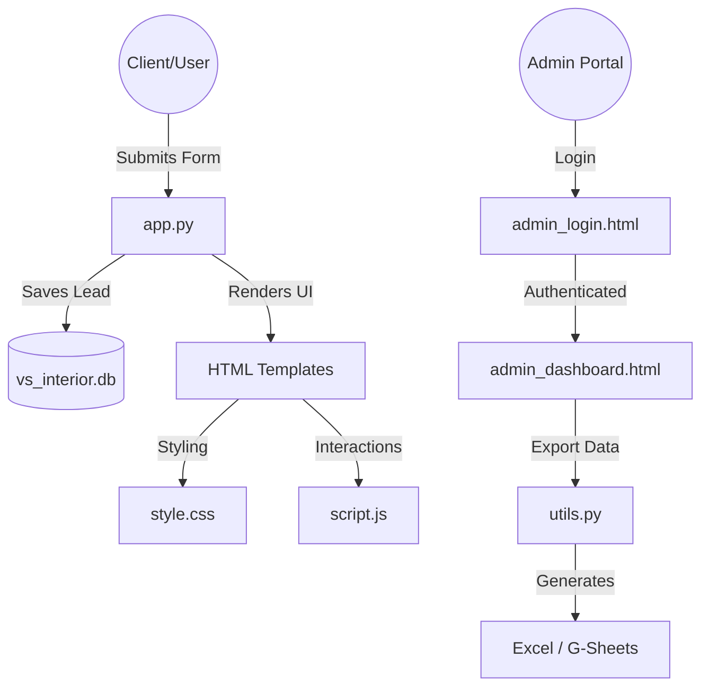

# V.S. INTERIOR — Project Structure & Documentation

This document provides a comprehensive overview of the **Enquiry Management System** architecture, file roles, and the logic connecting them.

---

### 🏗️ System Architecture & File Relationships

The project follows a standard **Flask (Python) Web Architecture**. The files are organized into three layers: **Logic (Backend)**, **Presentation (Frontend)**, and **Storage (Database)**.

---

### 📝 Detailed File Breakdown

#### 1. Backend & Logic Files
*   **`app.py`**
    *   **Role:** The "Brain" of the website.
    *   **Details:** Contains all URL routes (Home, Project Detail, Admin Login, Dashboard). It also holds the `projects_db`—the master list of projects, descriptions, and real photos.
*   **`models.py`**
    *   **Role:** Database Structure.
    *   **Details:** Defines what information is stored for each enquiry (Name, Email, Phone, Project Details, Date). Uses **SQLite** for local management.
*   **`utils.py`**
    *   **Role:** Helper Tools.
    *   **Details:** Logic for exporting leads to **Excel (.xlsx)** and syncing with **Google Sheets**.

#### 2. Frontend (Templates)
*   **`templates/index.html`**
    *   **Role:** Main Landing Page (Dynamic).
    *   **Details:** Displays the Hero slider, About section, Services, and the dynamic Project Gallery connected to the database.
*   **`templates/project.html`**
    *   **Role:** Dedicated Project Detail Page.
    *   **Details:** Dynamically renders high-resolution galleries and descriptions based on the project ID.
*   **`templates/admin_dashboard.html`**
    *   **Role:** Admin Command Center.
    *   **Details:** A protected table for managing incoming leads with search and export capabilities.

#### 3. Styling & Interactivity
*   **`static/css/style.css`**
    *   **Role:** Luxury Design System.
    *   **Details:** Handles typography, gold-accented styling, glassmorphism effects, and full mobile responsiveness.
*   **`static/js/script.js`**
    *   **Role:** Interactive Layer.
    *   **Details:** Manages the hero slider, project filtering (Commercial vs. Residential), and the mobile hamburger menu toggle.

#### 4. Storage & Configuration
*   **`vs_interior.db`**
    *   **Role:** Local Lead Database.
    *   **Details:** A secure SQLite file where all client enquiries are stored.
*   **`requirements.txt`**
    *   **Role:** Server Requirements.
    *   **Details:** Lists all Python libraries (Flask, Pandas, Openpyxl) needed to run the system.

---

### 🎨 Design Philosophy
The website is built with a **Premium Minimalist** aesthetic, reflecting the firm's 25-year legacy. It prioritizes:
- **Visual Excellence:** High-resolution imagery and elegant typography.
- **Micro-Animations:** Smooth transitions on scroll and hover.
- **Conversion focus:** Direct WhatsApp integration and a prominent consultation form.

---
*Last Updated: April 2026*
